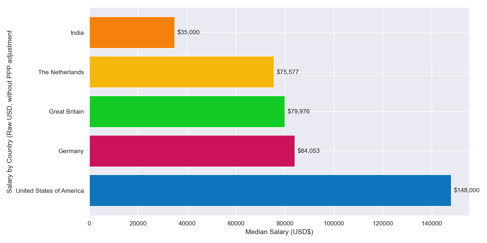
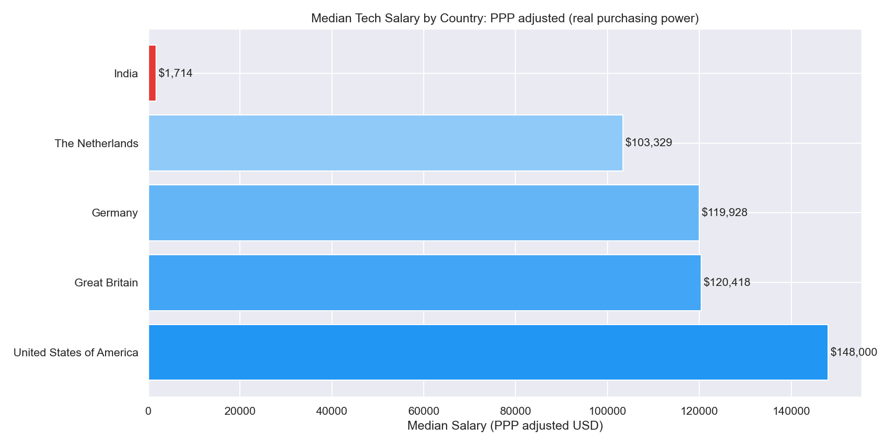
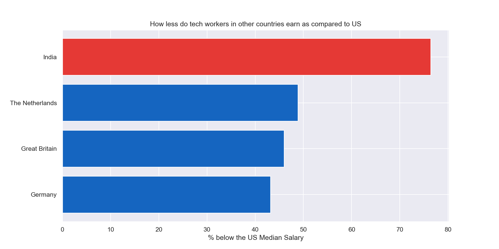

# remote salary benchmark

a data analysis project exploring whether remote tech workers in india 
are being underpaid compared to their US and european counterparts.

spoiler: they are. by a lot.

---

## what i found

- indian tech workers earn **76.4% less** than US counterparts in raw USD
- after PPP adjustment, the gap becomes **86x** — even accounting for cost of living
- ML engineers are the most underpaid role globally at **87.1% below US median**
- senior indian devs earn **$58k** vs **$159k** for senior US devs doing the same work
- uk and germany actually catch up to the US after PPP adjustment — the real story is india vs everyone else

---

## built with

- **python** — pandas, numpy, matplotlib, seaborn
- **sql** — sqlite3 for querying insights
- **google sheets** — benchmark report export via gspread
- **tableau** — interactive dashboard
- **streamlit** — live web app

---

## live links

- streamlit app → https://remotesalarybenchmark-espkehdxsazyccwg9ovtrr.streamlit.app
- tableau dashboard → (https://public.tableau.com/app/profile/kunal.verma7061/viz/RemoteSalaryBenchmark/RemoteSalarybenchmark-AreIndianTechWorkersbeingUnderpaid)

---

## data sources

- levels.fyi salary dataset (kaggle, 2024)
- US department of labor — H-1B LCA disclosure data FY2026
- world bank PPP conversion factors (2024)

---

## project structure

```
remote_salary_benchmark/
├── notebooks/
│   ├── 01_data_loading.ipynb
│   ├── 02_data_cleaning.ipynb
│   ├── 03_analysis.ipynb
│   ├── 04_sql_analysis.ipynb
│   └── 05_google_sheets.ipynb
├── data/
│   ├── raw_data/
│   └── cleaned_data/
├── outputs/charts/        ← all 6 charts
├── app/app.py             ← streamlit app
└── requirements.txt
```

---

## key charts





---

*built by kunal verma*